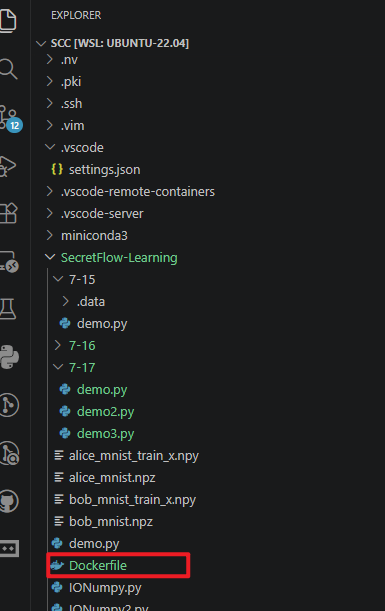
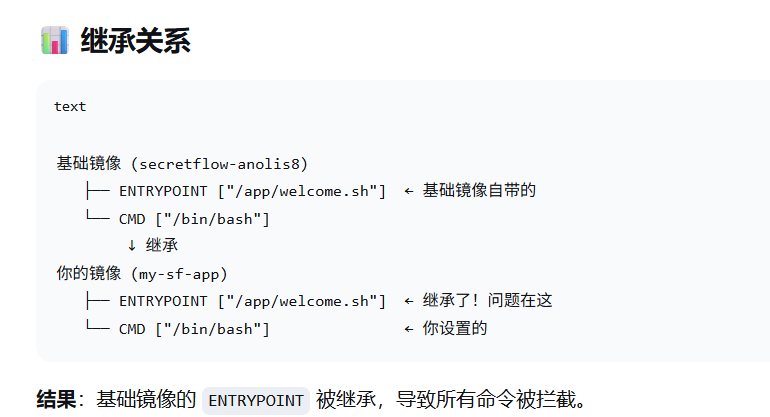
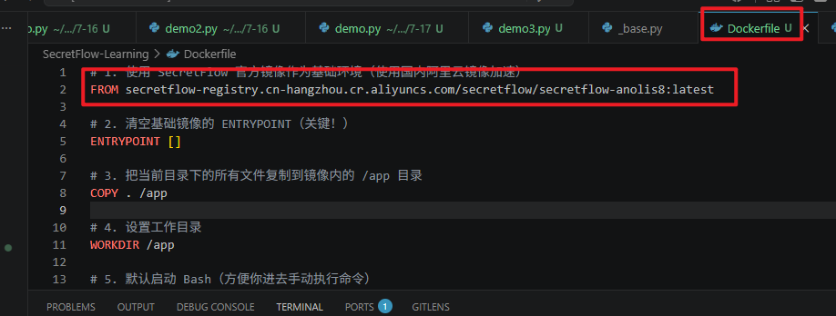
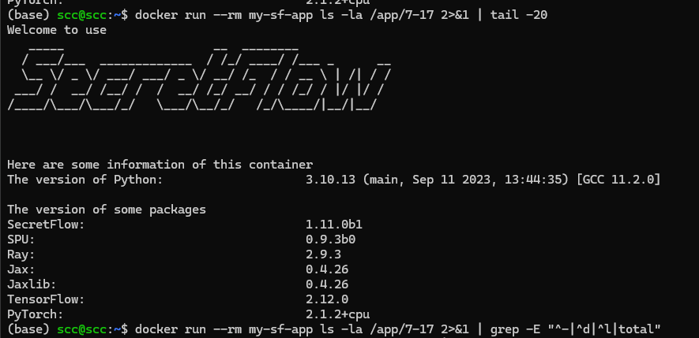
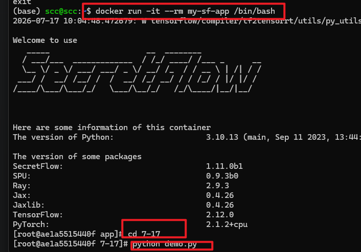

```
想把vscode中的代码打包然后部署到docker
1.首先和已有的环境无关，不用关心什么python，miniconda，secretflow。因为docker的分层结构所以在dockerfile里面写了from的基础只需要将自己的业务代码放在/app下即可详细步骤如下
```



```
这个Dockerfile位置应该在业务代码的根目录下里面的内容如下其中有两个需要注意的点
  一个是它的镜像建议改为国内镜像
  二个是entrypoint这个坑踩了很久，如果在自己的dockerfile里面不写上entrypoint[]那么可能继承原来镜像的entrypoint
```





```
如果没有entrypoint[]就会导致下面的问题
```



```
只有手动打开终端才可例如
```



常用的docker命令

```
1.docker ps : 查看目前运行的container(容器)
2.docker ps -a : 查看所有的containers（包括已经停止的容器）
3.docker images ；查看所有镜像文件
4.当下载镜像文件觉得太慢想要退出：ctrl+c就退出了但是这个时候前面下好的文件并没有删除所以常用的两个清除文件
4-1： docker buildx prune:专门清理 Docker 构建缓存，不涉及容器、镜像等其他对象
4-2： docker system prune:除了构建失败的，这个就是最常用的，清理系统中多种类型的无用资源，进行全面的磁盘空间回收

```

