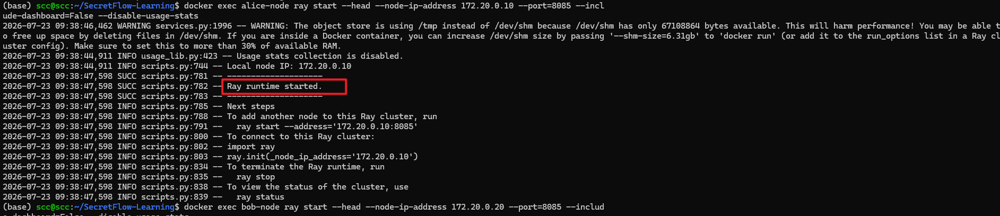
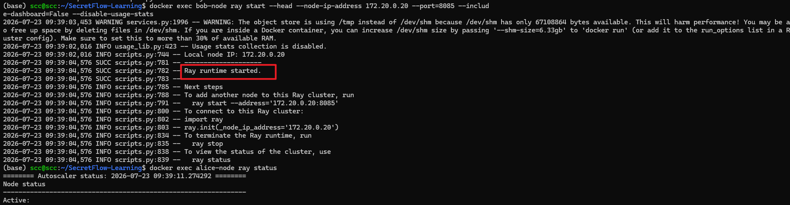
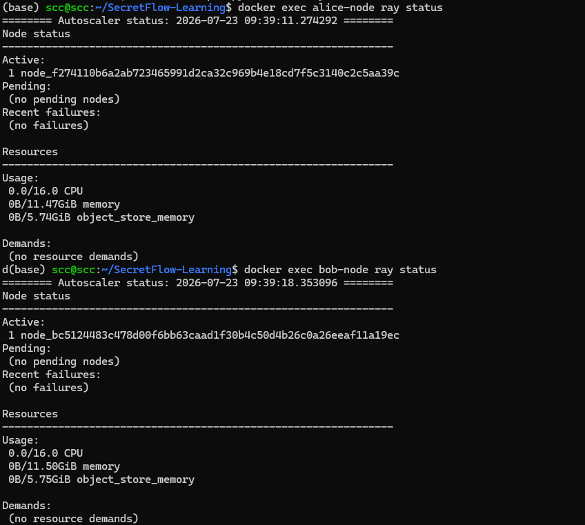
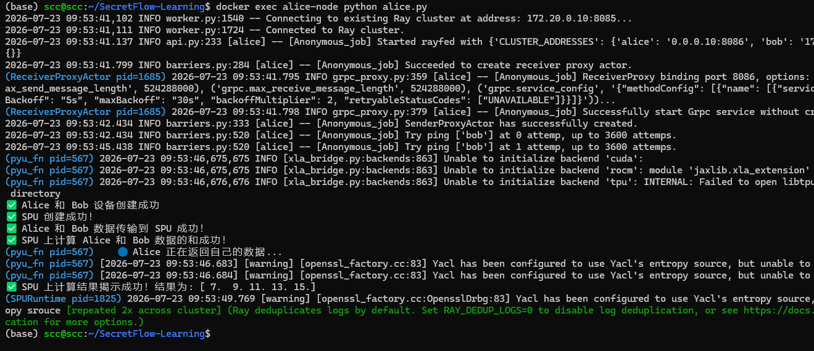
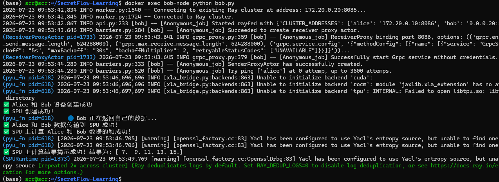
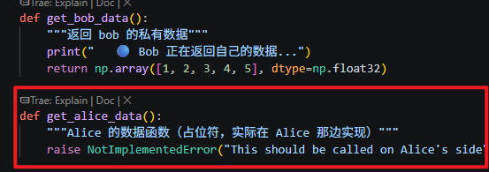

#        Docker：不同容器，不同IP，不同集群的仿真


一：创建网络：

```
docker network create --subnet 172.20.0.0/24 sf-network
```


二：创建容器

```
docker run -itd --name alice-node --network sf-network --ip 172.20.0.10 -v $(pwd)/7-23:/app my_sf_app
```


```
docker run -itd --name bob-node --network sf-network --ip 172.20.0.20 -v $(pwd)/7-
23:/app my_sf_app
```


三：启动ray

```
docker exec alice-node ray start --head --node-ip-address 172.20.0.10 --port=8085 --include-dashboard=False --disable-usage-stats
```



```
docker exec bob-node ray start --head --node-ip-address 172.20.0.20 --port=8085 --include-dashboard=False --disable-usage-stats
```



三-1：检查ray是否已经启动



四：因为是两个集群，所以需要开启两个终端同时启动





坑：

```
在python代码中因为要模拟不同机器上的数据所以需要定义函数返回空值因为如果不定义函数，比如在alice机器上调用了bob函数现实运行失败
```



通俗例子解释

## 完整故事：Alice想借用Bob的员工

### 场景设定

Alice有一个任务需要Bob帮忙，但Bob的员工不在Alice公司，Bob的员工在Bob公司。

### 第1步：Alice老板下达指令

python

```
# Alice的代码
bob_local = bob_pyu(lambda: np.array([6, 7, 8, 9, 10]))()
```


**Alice老板（Ray Head at 8085）说：**

> "我要Bob公司的员工帮我执行一个任务：把数据 `[6,7,8,9,10]` 准备好！"

### 第2步：Alice前台打电话给Bob前台

text

```
Alice老板(8085) → Alice前台(8086)：
"帮我联系Bob公司！"

Alice前台(8086) → 拨号到 Bob前台(8086)：
"喂，是Bob公司吗？我是Alice公司，我们老板想请你们帮个忙！"
```


**这里使用的就是8086端口！**

### 第3步：Bob前台转达给Bob老板

text

```
Bob前台(8086) → Bob老板(Ray Head at 8085)：
"老板，Alice公司来电话，想请我们帮忙执行一个任务！"

Bob老板(8085) 说：
"好的，我知道了。"
```


### 第4步：Bob老板安排员工干活

python

```
# Bob内部执行
bob_local = bob_pyu(lambda: np.array([6, 7, 8, 9, 10]))()
```


**Bob老板（Ray Head at 8085）对Bob员工说：**

> "来，你们几个（Ray Worker），去把 `[6,7,8,9,10]` 准备好！"

**Bob员工（Ray Worker）执行任务：**

> "好的老板！数据准备好了！"

### 第5步：Bob前台回电话给Alice前台

text

```
Bob老板(8085) → Bob前台(8086)：
"任务完成了，告诉Alice公司！"

Bob前台(8086) → 打电话给 Alice前台(8086)：
"喂，Alice公司吗？你们交代的任务完成了，数据准备好了！"
```


### 第6步：Alice前台转达给Alice老板

text

```
Alice前台(8086) → Alice老板(8085)：
"老板，Bob公司来电话了，说任务完成了！"

Alice老板(8085) 说：
"好的，我知道了。"
```


------

## 通信层级图

text

```
┌─────────────────────────────────────────────────────────────────┐
│                        跨公司通信                              │
│                   使用 8086 端口（前台电话）                    │
│                                                                 │
│  Alice公司                       Bob公司                        │
│  ┌──────────────┐               ┌──────────────┐               │
│  │ 👔 老板      │               │ 👔 老板      │               │
│  │ (Ray 8085)   │               │ (Ray 8085)   │               │
│  └──────┬───────┘               └──────┬───────┘               │
│         │ 内部命令                      │ 内部命令              │
│         ▼                               ▼                       │
│  ┌──────────────┐               ┌──────────────┐               │
│  │ 📞 前台      │◄──── 8086 ────│ 📞 前台      │               │
│  │ (SecretFlow) │─── 打电话 ───►│ (SecretFlow) │               │
│  └──────────────┘               └──────────────┘               │
│         │                               │                       │
│         ▼                               ▼                       │
│  ┌──────────────┐               ┌──────────────┐               │
│  │ 👷 员工      │               │ 👷 员工      │               │
│  │ (Ray Worker) │               │ (Ray Worker) │               │
│  └──────────────┘               └──────────────┘               │
└─────────────────────────────────────────────────────────────────┘
```

## 完整流程代码对应

### 第1步：Alice老板下达指令（Alice的Ray）

python

```
# 这句话的意思是：
# Alice老板说："我要调用Bob公司的一个函数！"
bob_local = bob_pyu(lambda: np.array([6, 7, 8, 9, 10]))()
```


### 第2-3步：Alice前台联系Bob前台（通过8086）

text

```
Alice的SecretFlow (8086) 发送请求到 Bob的SecretFlow (8086)

请求内容：
"请帮我执行一个函数，参数是 [6,7,8,9,10]"
```


### 第4步：Bob老板安排员工（Bob的Ray）

text

```
Bob的SecretFlow (8086) 收到请求后，转交给 Bob的Ray (8085)

Bob的Ray说：
"好的，我安排员工执行"
```


### 第5-6步：Bob前台回电话（通过8086）

text

```
Bob的SecretFlow (8086) 发送结果到 Alice的SecretFlow (8086)

结果内容：
"任务完成了，这是结果数据"
```


------

## 为什么说"Alice的Ray给Bob的Ray打电话"？

严格来说，**不是Ray直接打电话**，而是：

text

```
Alice的Ray → Alice的SecretFlow(8086) → Bob的SecretFlow(8086) → Bob的Ray
```


但为了简化理解，我们常说"Ray打电话"，因为：

1. **发起者**是Alice的Ray（老板下达指令）
2. **最终执行者**是Bob的Ray（老板安排员工）
3. 中间经过的8086只是**前台转接**

就像：

text

```
老板说："帮我联系Bob公司"
前台打电话："喂，是Bob公司吗？"
Bob前台接电话："好的，我转告我们老板"
Bob老板听到后："我知道了，安排员工去做"
```


整个过程，**真正干活的是两家公司的老板和员工（Ray）**，**前台（8086）只是传话的**。