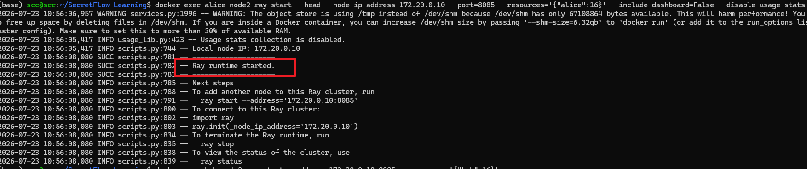
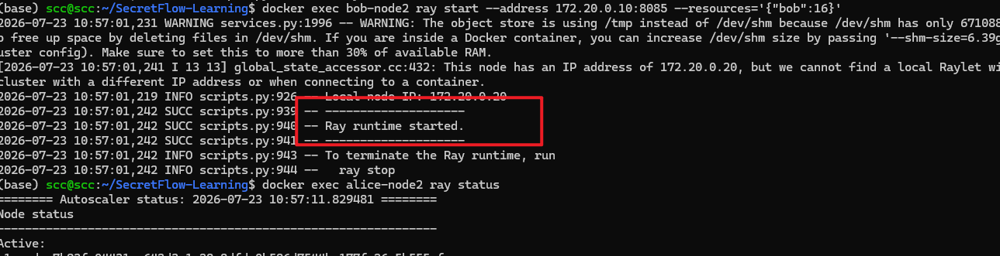
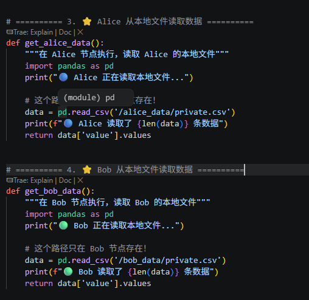

#      在Docker里面不同容器不同IP同一集群部署

一：创建容器：

```
docker run -itd --name alice-node2 --network sf-network --ip 172.20.0.10 -v $(pwd)/7-23:/app my_sf_app
```


```
docker run -itd --name bob-node2 --network sf-network --ip 172.20.0.20 -v $(pwd)/7-23:/app my_sf_app
```


二：启动ray

```
docker exec alice-node2 ray start --head --node-ip-address 172.20.0.10 --port=8085 --resources='{"alice":16}' --include-dashboard=False --disable-usage-stats
```



```
docker exec bob-node2 ray start --address 172.20.0.10:8085 --resources='{"bob":16}'
注意点：从节点不用node-ip-addresss直接address加上端口
而且同一集群：没有cluster——config因为都在同一集群所以不需要前台只要spu的cluster_def即可
```



只要一个代码随便在哪个机器上运行即可，核心就是说如果a的本地数据是b没有的那么就可以把这个任务分配给a

看alice_2就懂了

